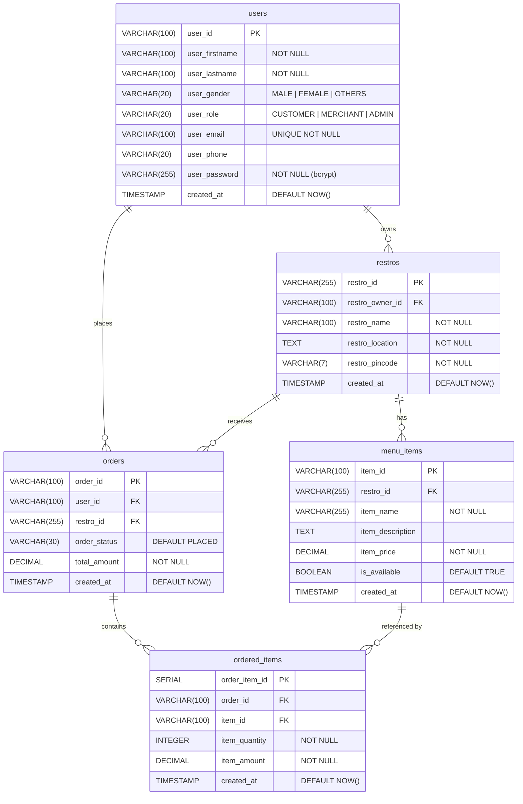

# Obsidian — Food Ordering Platform

A full-stack food ordering platform with three portals — **Customer**, **Merchant**, and **Admin** — built as a monorepo.

```
Mega-Backend/
├── Backend/    → Node.js + Express REST API + PostgreSQL
└── Frontend/   → React SPA (Vite + TanStack Router)
```

---

## Tech Stack

| Layer | Technology |
|---|---|
| Backend | Node.js, Express 5, pg-promise (PostgreSQL) |
| Auth | JWT (access + refresh tokens), bcrypt, cookie-parser |
| Database | PostgreSQL 16 (Docker), pgAdmin 4 |
| Frontend | React 19, Vite 8, TanStack Router, TanStack Query |
| Styling | Tailwind CSS v4, custom design tokens |
| Dev | Docker Compose, nodemon |

---

## Project Structure

```
Backend/
├── src/
│   ├── server.js            ← Express app entry point
│   ├── auth/
│   │   ├── authFunctions.js ← JWT helpers, bcrypt
│   │   └── authMiddleware.js
│   ├── config/
│   │   └── db.js            ← pg-promise connection
│   ├── controllers/         ← Request handlers
│   ├── models/              ← DB query functions
│   ├── routes/
│   │   ├── authRoutes.js
│   │   ├── userRoutes.js
│   │   ├── restroRoutes.js
│   │   └── orderRoutes.js
│   ├── services/            ← Business logic
│   ├── Migrations/          ← One-time table creation scripts
│   └── errorCodes.json
├── .env
├── Dockerfile
└── docker-compose.yml

Frontend/
├── src/
│   ├── main.jsx             ← React entry point
│   ├── router.jsx           ← TanStack Router setup
│   ├── routeTree.gen.js     ← Auto-generated (do not edit)
│   ├── routes/              ← File-based routing
│   │   ├── __root.jsx
│   │   ├── index.jsx
│   │   ├── _auth.jsx
│   │   ├── _auth/login.jsx
│   │   ├── _auth/register.jsx
│   │   ├── admin/
│   │   ├── customer/
│   │   └── merchant/
│   ├── pages/               ← Page components
│   ├── components/          ← Shared UI (auth/, cards/, common/, forms/)
│   ├── layouts/             ← AdminLayout, CustomerLayout, MerchantLayout, AuthLayout
│   ├── data/mock.js         ← Placeholder data (replace with API calls)
│   ├── styles.css           ← Tailwind v4 + design tokens
│   └── main.css             ← Custom utility classes
├── index.html
└── vite.config.js
```

---

## Database Schema

### Entity Relationship Diagram



> All foreign keys use `ON DELETE CASCADE`.

---

## Getting Started

### Prerequisites
- [Docker Desktop](https://www.docker.com/products/docker-desktop/)
- [Node.js 22+](https://nodejs.org/)

---

### 1. Configure Environment

Edit `Backend/.env`:

```env
PORT=5000

POSTGRES_DB=obsidian
POSTGRES_USER=postgres
POSTGRES_PASSWORD=postgres
POSTGRES_PORT=5432

PGADMIN_EMAIL=admin@example.com
PGADMIN_PASSWORD=admin
PGADMIN_PORT=5050

IS_AUTH=false
JWT_ACCESS_SECRET=<your-secret>
JWT_REFRESH_SECRET=<your-secret>
JWT_ACCESS_EXPIRES=15m
JWT_REFRESH_EXPIRES=7d
```

---

### 2. Start the Backend (Docker)

```bash
cd Backend
docker compose up
```

| Service | URL |
|---|---|
| Express API | http://localhost:5000 |
| PostgreSQL | localhost:5432 |
| pgAdmin | http://localhost:5050 |

---

### 3. Run Migrations (one-time)

Run in order — child tables depend on parent tables:

```bash
cd Backend
node src/Migrations/userTable.js
node src/Migrations/restroTable.js
node src/Migrations/menuItemsTable.js
node src/Migrations/orderTable.js
node src/Migrations/orderedItemsTable.js
```

---

### 4. Start the Frontend

```bash
cd Frontend
npm install
npm run dev
```

Frontend runs at **http://localhost:5173**

---

## API Reference

### Auth — `/auth`
| Method | Endpoint | Description |
|---|---|---|
| POST | `/auth/register` | Register a new user |
| POST | `/auth/login` | Login, returns JWT in cookies |
| POST | `/auth/refresh` | Refresh access token |
| POST | `/auth/logout` | Clear auth cookies |

### Users — `/user`
| Method | Endpoint | Description |
|---|---|---|
| POST | `/user/createUser` | Create a user |
| GET | `/user/getUser/:user_id` | Get a single user |
| GET | `/user/getAllUsers` | Get all users |
| PUT | `/user/editUser/:user_id` | Edit user details |
| DELETE | `/user/deleteUser/:user_id` | Delete a user |

### Restaurants — `/restro`
| Method | Endpoint | Description |
|---|---|---|
| POST | `/restro/createRestro` | Create a restaurant |
| GET | `/restro/getRestro/:restro_id` | Get a single restaurant |
| GET | `/restro/getAllRestros` | Get all restaurants |
| PUT | `/restro/editRestro/:restro_id` | Edit restaurant details |
| DELETE | `/restro/deleteRestro/:restro_id` | Delete a restaurant |

### Menu Items — `/restro`
| Method | Endpoint | Description |
|---|---|---|
| POST | `/restro/createMenuItem` | Create a menu item |
| GET | `/restro/getMenuItem/:item_id` | Get a single menu item |
| GET | `/restro/getAllMenuItems/:restro_id` | Get all items for a restaurant |
| PUT | `/restro/editMenuItem/:item_id` | Edit a menu item |
| DELETE | `/restro/deleteMenuItem/:item_id` | Delete a menu item |

### Orders — `/order`
| Method | Endpoint | Description |
|---|---|---|
| POST | `/order/createOrder` | Place an order |
| GET | `/order/getOrder/:order_id` | Get a single order |
| GET | `/order/getAllOrders` | Get all orders |
| PUT | `/order/editOrder/:order_id` | Update order status |
| DELETE | `/order/deleteOrder/:order_id` | Delete an order |

### Ordered Items — `/order`
| Method | Endpoint | Description |
|---|---|---|
| POST | `/order/createOrderedItem` | Add an item to an order |
| GET | `/order/getOrderedItem/:order_item_id` | Get a single ordered item |
| GET | `/order/getAllOrderedItems/:order_id` | Get all items for an order |
| PUT | `/order/editOrderedItem/:order_item_id` | Edit an ordered item |
| DELETE | `/order/deleteOrderedItem/:order_item_id` | Remove an ordered item |

---

## Frontend Routes

| Path | Portal | Description |
|---|---|---|
| `/` | — | Landing page |
| `/login` | Auth | Login |
| `/register` | Auth | Register |
| `/customer/home` | Customer | Browse restaurants |
| `/customer/restro/:restroId` | Customer | Restaurant menu |
| `/customer/cart` | Customer | Shopping cart |
| `/customer/orders` | Customer | Order history |
| `/customer/orders/:orderId` | Customer | Order detail |
| `/customer/profile` | Customer | Edit profile |
| `/merchant/dashboard` | Merchant | Overview and recent orders |
| `/merchant/menu` | Merchant | Manage menu items |
| `/merchant/orders` | Merchant | Incoming orders |
| `/merchant/orders/:orderId` | Merchant | Order detail |
| `/merchant/restaurant` | Merchant | Restaurant settings |
| `/merchant/profile` | Merchant | Edit profile |
| `/admin/dashboard` | Admin | Platform overview |
| `/admin/users` | Admin | Manage users |
| `/admin/users/:userId` | Admin | User detail |
| `/admin/restros` | Admin | Manage restaurants |
| `/admin/restros/:restroId` | Admin | Restaurant detail |
| `/admin/orders` | Admin | All orders |
| `/admin/orders/:orderId` | Admin | Order detail |

---

## Development Notes

- **Auth toggle** — Set `IS_AUTH=false` in `.env` to bypass JWT middleware during development.
- **Mock data** — The frontend uses `src/data/mock.js` as placeholder data. Replace with real API calls when integrating the backend.
- **Route tree** — `src/routeTree.gen.js` is auto-generated on every `npm run dev` by the TanStack Router Vite plugin. Do not edit it manually.
- **pgAdmin** — Accessible at `http://localhost:5050` with the credentials from your `.env`.