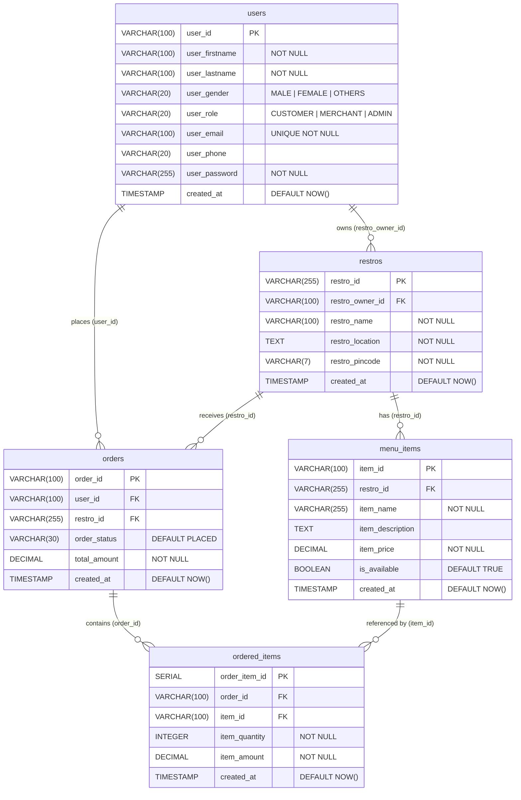

# Obsidian Backend

A RESTful backend for a food ordering platform built with **Node.js**, **Express**, and **PostgreSQL** (via pg-promise). Runs via Docker Compose.

---

## Database Schema

### Entity Relationship Diagram



---

## Table Details

### `users`
| Column | Type | Constraints |
|---|---|---|
| `user_id` | VARCHAR(100) | PRIMARY KEY |
| `user_firstname` | VARCHAR(100) | NOT NULL |
| `user_lastname` | VARCHAR(100) | NOT NULL |
| `user_gender` | VARCHAR(20) | CHECK (`MALE`, `FEMALE`, `OTHERS`) |
| `user_role` | VARCHAR(20) | CHECK (`CUSTOMER`, `MERCHANT`, `ADMIN`) |
| `user_email` | VARCHAR(100) | UNIQUE, NOT NULL |
| `user_phone` | VARCHAR(20) | |
| `user_password` | VARCHAR(255) | NOT NULL (bcrypt hashed) |
| `created_at` | TIMESTAMP | DEFAULT CURRENT_TIMESTAMP |

---

### `restros`
| Column | Type | Constraints |
|---|---|---|
| `restro_id` | VARCHAR(255) | PRIMARY KEY |
| `restro_owner_id` | VARCHAR(100) | NOT NULL, FK → `users.user_id` ON DELETE CASCADE |
| `restro_name` | VARCHAR(100) | NOT NULL |
| `restro_location` | TEXT | NOT NULL |
| `restro_pincode` | VARCHAR(7) | NOT NULL |
| `created_at` | TIMESTAMP | DEFAULT CURRENT_TIMESTAMP |

---

### `menu_items`
| Column | Type | Constraints |
|---|---|---|
| `item_id` | VARCHAR(100) | PRIMARY KEY |
| `restro_id` | VARCHAR(255) | NOT NULL, FK → `restros.restro_id` ON DELETE CASCADE |
| `item_name` | VARCHAR(255) | NOT NULL |
| `item_description` | TEXT | |
| `item_price` | DECIMAL(10,2) | NOT NULL |
| `is_available` | BOOLEAN | DEFAULT TRUE |
| `created_at` | TIMESTAMP | DEFAULT CURRENT_TIMESTAMP |

---

### `orders`
| Column | Type | Constraints |
|---|---|---|
| `order_id` | VARCHAR(100) | PRIMARY KEY, NOT NULL |
| `user_id` | VARCHAR(100) | NOT NULL, FK → `users.user_id` ON DELETE CASCADE |
| `restro_id` | VARCHAR(255) | NOT NULL, FK → `restros.restro_id` ON DELETE CASCADE |
| `order_status` | VARCHAR(30) | DEFAULT `PLACED` |
| `total_amount` | DECIMAL(10,2) | NOT NULL |
| `created_at` | TIMESTAMP | DEFAULT CURRENT_TIMESTAMP |

---

### `ordered_items`
| Column | Type | Constraints |
|---|---|---|
| `order_item_id` | SERIAL | PRIMARY KEY (auto-increment) |
| `order_id` | VARCHAR(100) | NOT NULL, FK → `orders.order_id` ON DELETE CASCADE |
| `item_id` | VARCHAR(100) | NOT NULL, FK → `menu_items.item_id` ON DELETE CASCADE |
| `item_quantity` | INTEGER | NOT NULL |
| `item_amount` | DECIMAL(10,2) | NOT NULL |
| `created_at` | TIMESTAMP | DEFAULT CURRENT_TIMESTAMP |

---

## Foreign Key Relationships

```
users ──────────────────┬──► restros.restro_owner_id   (1 user owns many restros)
                        └──► orders.user_id              (1 user places many orders)

restros ────────────────┬──► menu_items.restro_id       (1 restro has many menu items)
                        └──► orders.restro_id            (1 restro receives many orders)

orders  ───────────────────► ordered_items.order_id     (1 order contains many items)

menu_items ────────────────► ordered_items.item_id      (1 menu item in many order lines)
```

> All foreign keys use `ON DELETE CASCADE` — deleting a parent automatically removes all its children.

---

## Running the Project

### Start with Docker Compose
```bash
docker compose up
```

### Run Migrations (one-time setup)
```bash
node src/Migrations/userTable.js
node src/Migrations/restroTable.js
node src/Migrations/menuItemsTable.js
node src/Migrations/orderTable.js
node src/Migrations/orderedItemsTable.js
```

> Run migrations **in order** — child tables depend on parent tables existing first.

---

## API Routes

### User — `/user`
| Method | Endpoint | Description |
|---|---|---|
| POST | `/user/createUser` | Create a new user |
| PUT | `/user/editUser/:user_id` | Edit user details |
| GET | `/user/getUser/:user_id` | Get a single user |
| GET | `/user/getAllUsers` | Get all users |
| DELETE | `/user/deleteUser/:user_id` | Delete a user |

### Restaurant — `/restro`
| Method | Endpoint | Description |
|---|---|---|
| POST | `/restro/createRestro` | Create a restro (also creates owner user) |
| PUT | `/restro/editRestro/:restro_id` | Edit restro details |
| GET | `/restro/getRestro/:restro_id` | Get a single restro |
| GET | `/restro/getAllRestros` | Get all restros |
| DELETE | `/restro/deleteRestro/:restro_id` | Delete a restro |

### Menu Items — `/restro`
| Method | Endpoint | Description |
|---|---|---|
| POST | `/restro/createMenuItem` | Create a menu item |
| PUT | `/restro/editMenuItem/:item_id` | Edit a menu item |
| GET | `/restro/getMenuItem/:item_id` | Get a single menu item |
| GET | `/restro/getAllMenuItems/:restro_id` | Get all menu items for a restro |
| DELETE | `/restro/deleteMenuItem/:item_id` | Delete a menu item |

### Orders — `/order`
| Method | Endpoint | Description |
|---|---|---|
| POST | `/order/createOrder` | Create an order |
| PUT | `/order/editOrder/:order_id` | Edit an order |
| GET | `/order/getOrder/:order_id` | Get a single order |
| GET | `/order/getAllOrders` | Get all orders |
| DELETE | `/order/deleteOrder/:order_id` | Delete an order |

### Ordered Items — `/order`
| Method | Endpoint | Description |
|---|---|---|
| POST | `/order/createOrderedItem` | Add an item to an order |
| PUT | `/order/editOrderedItem/:order_item_id` | Edit an ordered item |
| GET | `/order/getOrderedItem/:order_item_id` | Get a single ordered item |
| GET | `/order/getAllOrderedItems/:order_id` | Get all items for an order |
| DELETE | `/order/deleteOrderedItem/:order_item_id` | Delete an ordered item |
