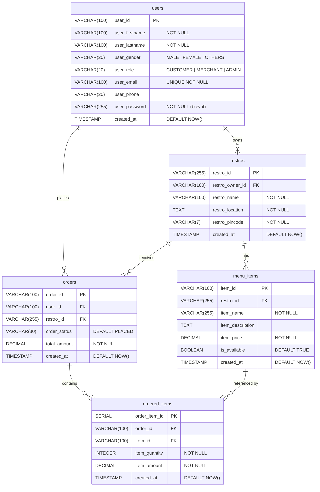

# Obsidian — Food Ordering Platform

A full-stack food ordering platform with three portals — **Customer**, **Merchant**, and **Admin** — built as a monorepo.

```
Mega-Backend/
├── Backend/    → Node.js + Express REST API + PostgreSQL
└── Frontend/   → React SPA (Vite + TanStack Router)
```

---

## Tech Stack

| Layer | Technology |
|---|---|
| Backend | Node.js, Express 5, pg-promise (PostgreSQL) |
| Auth | JWT (access + refresh tokens), bcrypt, cookie-parser |
| Database | PostgreSQL 16 (Docker), pgAdmin 4 |
| Frontend | React 19, Vite 8, TanStack Router, TanStack Query |
| Styling | Tailwind CSS v4, custom design tokens |
| Dev | Docker Compose, nodemon |

---

## Project Structure

```
Backend/
├── src/
│   ├── server.js            ← Express app entry point
│   ├── auth/
│   │   ├── authFunctions.js ← JWT helpers, bcrypt
│   │   └── authMiddleware.js
│   ├── config/
│   │   └── db.js            ← pg-promise connection
│   ├── controllers/         ← Request handlers
│   ├── models/              ← DB query functions
│   ├── routes/
│   │   ├── authRoutes.js
│   │   ├── userRoutes.js
│   │   ├── restroRoutes.js
│   │   └── orderRoutes.js
│   ├── services/            ← Business logic
│   ├── Migrations/          ← One-time table creation scripts
│   └── errorCodes.json
├── .env
├── Dockerfile
└── docker-compose.yml

Frontend/
├── src/
│   ├── main.jsx             ← React entry point
│   ├── router.jsx           ← TanStack Router setup
│   ├── routeTree.gen.js     ← Auto-generated (do not edit)
│   ├── routes/              ← File-based routing
│   │   ├── __root.jsx
│   │   ├── index.jsx
│   │   ├── _auth.jsx
│   │   ├── _auth/login.jsx
│   │   ├── _auth/register.jsx
│   │   ├── admin/
│   │   ├── customer/
│   │   └── merchant/
│   ├── pages/               ← Page components
│   ├── components/          ← Shared UI (auth/, cards/, common/, forms/)
│   ├── layouts/             ← AdminLayout, CustomerLayout, MerchantLayout, AuthLayout
│   ├── data/mock.js         ← Placeholder data (replace with API calls)
│   ├── styles.css           ← Tailwind v4 + design tokens
│   └── main.css             ← Custom utility classes
├── index.html
└── vite.config.js
```

---

## Database Schema

### Entity Relationship Diagram



> All foreign keys use `ON DELETE CASCADE`.

---

## Getting Started

### Prerequisites
- [Docker Desktop](https://www.docker.com/products/docker-desktop/)
- [Node.js 22+](https://nodejs.org/)

---

### 1. Configure Environment

Edit `Backend/.env`:

```env
PORT=5000

POSTGRES_DB=obsidian
POSTGRES_USER=postgres
POSTGRES_PASSWORD=postgres
POSTGRES_PORT=5432

PGADMIN_EMAIL=admin@example.com
PGADMIN_PASSWORD=admin
PGADMIN_PORT=5050

IS_AUTH=false
JWT_ACCESS_SECRET=<your-secret>
JWT_REFRESH_SECRET=<your-secret>
JWT_ACCESS_EXPIRES=15m
JWT_REFRESH_EXPIRES=7d
```

---

### 2. Start the Backend (Docker)

```bash
cd Backend
docker compose up
```

| Service | URL |
|---|---|
| Express API | http://localhost:5000 |
| PostgreSQL | localhost:5432 |
| pgAdmin | http://localhost:5050 |

---

### 3. Run Migrations (one-time)

Run in order — child tables depend on parent tables:

```bash
cd Backend
node src/Migrations/userTable.js
node src/Migrations/restroTable.js
node src/Migrations/menuItemsTable.js
node src/Migrations/orderTable.js
node src/Migrations/orderedItemsTable.js
```

---

### 4. Start the Frontend

```bash
cd Frontend
npm install
npm run dev
```

Frontend runs at **http://localhost:5173**

---

## API Reference

### Auth — `/auth`
| Method | Endpoint | Description |
|---|---|---|
| POST | `/auth/register` | Register a new user |
| POST | `/auth/login` | Login, returns JWT in cookies |
| POST | `/auth/refresh` | Refresh access token |
| POST | `/auth/logout` | Clear auth cookies |

### Users — `/user`
| Method | Endpoint | Description |
|---|---|---|
| POST | `/user/createUser` | Create a user |
| GET | `/user/getUser/:user_id` | Get a single user |
| GET | `/user/getAllUsers` | Get all users |
| PUT | `/user/editUser/:user_id` | Edit user details |
| DELETE | `/user/deleteUser/:user_id` | Delete a user |

### Restaurants — `/restro`
| Method | Endpoint | Description |
|---|---|---|
| POST | `/restro/createRestro` | Create a restaurant |
| GET | `/restro/getRestro/:restro_id` | Get a single restaurant |
| GET | `/restro/getAllRestros` | Get all restaurants |
| PUT | `/restro/editRestro/:restro_id` | Edit restaurant details |
| DELETE | `/restro/deleteRestro/:restro_id` | Delete a restaurant |

### Menu Items — `/restro`
| Method | Endpoint | Description |
|---|---|---|
| POST | `/restro/createMenuItem` | Create a menu item |
| GET | `/restro/getMenuItem/:item_id` | Get a single menu item |
| GET | `/restro/getAllMenuItems/:restro_id` | Get all items for a restaurant |
| PUT | `/restro/editMenuItem/:item_id` | Edit a menu item |
| DELETE | `/restro/deleteMenuItem/:item_id` | Delete a menu item |

### Orders — `/order`
| Method | Endpoint | Description |
|---|---|---|
| POST | `/order/createOrder` | Place an order |
| GET | `/order/getOrder/:order_id` | Get a single order |
| GET | `/order/getAllOrders` | Get all orders |
| PUT | `/order/editOrder/:order_id` | Update order status |
| DELETE | `/order/deleteOrder/:order_id` | Delete an order |

### Ordered Items — `/order`
| Method | Endpoint | Description |
|---|---|---|
| POST | `/order/createOrderedItem` | Add an item to an order |
| GET | `/order/getOrderedItem/:order_item_id` | Get a single ordered item |
| GET | `/order/getAllOrderedItems/:order_id` | Get all items for an order |
| PUT | `/order/editOrderedItem/:order_item_id` | Edit an ordered item |
| DELETE | `/order/deleteOrderedItem/:order_item_id` | Remove an ordered item |

---

## Frontend Routes

| Path | Portal | Description |
|---|---|---|
| `/` | — | Landing page |
| `/login` | Auth | Login |
| `/register` | Auth | Register |
| `/customer/home` | Customer | Browse restaurants |
| `/customer/restro/:restroId` | Customer | Restaurant menu |
| `/customer/cart` | Customer | Shopping cart |
| `/customer/orders` | Customer | Order history |
| `/customer/orders/:orderId` | Customer | Order detail |
| `/customer/profile` | Customer | Edit profile |
| `/merchant/dashboard` | Merchant | Overview and recent orders |
| `/merchant/menu` | Merchant | Manage menu items |
| `/merchant/orders` | Merchant | Incoming orders |
| `/merchant/orders/:orderId` | Merchant | Order detail |
| `/merchant/restaurant` | Merchant | Restaurant settings |
| `/merchant/profile` | Merchant | Edit profile |
| `/admin/dashboard` | Admin | Platform overview |
| `/admin/users` | Admin | Manage users |
| `/admin/users/:userId` | Admin | User detail |
| `/admin/restros` | Admin | Manage restaurants |
| `/admin/restros/:restroId` | Admin | Restaurant detail |
| `/admin/orders` | Admin | All orders |
| `/admin/orders/:orderId` | Admin | Order detail |

---

## Development Notes

- **Auth toggle** — Set `IS_AUTH=false` in `.env` to bypass JWT middleware during development.
- **Mock data** — The frontend uses `src/data/mock.js` as placeholder data. Replace with real API calls when integrating the backend.
- **Route tree** — `src/routeTree.gen.js` is auto-generated on every `npm run dev` by the TanStack Router Vite plugin. Do not edit it manually.
- **pgAdmin** — Accessible at `http://localhost:5050` with the credentials from your `.env`.

---

## Authentication — Deep Dive

The auth system is split across four layers: **utility functions → middleware → controller → service → model**. Each layer has a single responsibility.

```
Request
  │
  ▼
authMiddleware        ← verifies access token on protected routes
  │
  ▼
authController        ← HTTP request/response handling
  │
  ▼
authService           ← business logic (validate credentials, issue tokens)
  │
  ├── authFunctions   ← pure crypto helpers (bcrypt, JWT)
  └── authModels      ← DB queries for refresh-token storage
```

---

### Token Strategy

The system uses a **dual-token pattern**:

| Token | Storage | Lifetime | Purpose |
|---|---|---|---|
| Access Token (JWT) | Response body / memory | `15m` (default) | Authorise API requests via `Authorization: Bearer <token>` |
| Refresh Token (JWT) | `httpOnly` cookie | `7d` (default) | Obtain new access tokens without re-login |

The refresh token's **JTI (JWT ID)** is stored in a `refresh_tokens` DB table so tokens can be individually revoked on logout — preventing refresh-token reuse even if a token is stolen before it expires.

---

### Auth Flow Diagrams

#### Login / Register

```
Client                          Server
  │── POST /auth/login ────────▶ loginController
  │                                   │── authService.loginService()
  │                                   │     ├── authFunctions.comparePassword()   [bcrypt.compare]
  │                                   │     ├── authFunctions.generateAccessToken()  [jwt.sign, 15m]
  │                                   │     ├── authFunctions.generateRefreshToken() [jwt.sign, 7d + uuid jti]
  │                                   │     └── authModel.insertJTI()            [save jti to DB]
  │◀── 200 { accessToken } ──────────┤
  │    Set-Cookie: refreshToken ──────┘
```

#### Authenticated Request

```
Client                          Server
  │── GET /some/protected ───▶ authMiddleware
  │   Authorization: Bearer      │── authFunctions.verifyJWT(token)   [jwt.verify]
  │   <accessToken>              │── req.user = decoded payload
  │                              └──▶ next() → actual controller
  │◀── 200 { data } ─────────────┘
```

#### Token Refresh

```
Client                          Server
  │── POST /auth/refresh ──────▶ refreshController
  │   Cookie: refreshToken         │── authService.refreshService()
  │                                │     ├── jwt.verify(refreshToken)
  │                                │     ├── authModel.getJTI(jti)      [check not revoked]
  │                                │     └── authFunctions.generateAccessToken()
  │◀── 200 { accessToken } ────────┘
```

#### Logout

```
Client                          Server
  │── POST /auth/logout ───────▶ logoutController
  │   Cookie: refreshToken         │── authService.logoutService()
  │                                │     ├── jwt.verify(refreshToken)
  │                                │     └── authModel.revokeJTI(jti)   [set revoked_at in DB]
  │                                └── res.clearCookie('refreshToken')
  │◀── 200 { success: true } ──────┘
```

---

### `authFunctions.js` — Crypto Utilities

> **Path:** `Backend/src/auth/authFunctions.js`

Pure helper functions with no side-effects. They do not touch the database or HTTP layer.

#### `hashPassword(pass)`

| | |
|---|---|
| **Input** | Plain-text password string |
| **Output** | bcrypt hash string (salt rounds: `10`) |
| **Used by** | `userService.createUserService` during registration |

Wraps `bcrypt.hash`. The cost factor of `10` strikes a balance between security and CPU time.

#### `comparePassword(user_email, user_pass)`

| | |
|---|---|
| **Input** | User email + plain-text password |
| **Output** | `true` / `false` |
| **Used by** | `authService.loginService` |

Fetches the user record (via `userService`) to retrieve the stored hash, then runs `bcrypt.compare`. Throws if the user is not found.

#### `generateAccessToken(user)`

| | |
|---|---|
| **Input** | `{ user_id }` |
| **Output** | Signed JWT string |
| **Payload** | `{ user_id, iat, exp }` |
| **Secret** | `JWT_ACCESS_SECRET` env var |
| **Expiry** | `JWT_ACCESS_EXPIRES` env var (default `15m`) |

Short-lived token. Should be kept in memory on the client and never in `localStorage`.

#### `generateRefreshToken(user)`

| | |
|---|---|
| **Input** | `{ user_id }` |
| **Output** | `{ refreshToken, jti, expiresAt }` |
| **Payload** | `{ user_id, jti, iat, exp }` |
| **Secret** | `JWT_REFRESH_SECRET` env var |
| **Expiry** | `JWT_REFRESH_EXPIRES` env var (default `7d`) |

Generates a `crypto.randomUUID()` as the **JTI** (JWT ID) and embeds it in the token. The returned `jti` and `expiresAt` are persisted to the DB by the service layer, enabling server-side revocation.

#### `verifyJWT(token)`

| | |
|---|---|
| **Input** | JWT string (access token) |
| **Output** | Decoded payload object `{ user_id, iat, exp }` |
| **Secret** | `JWT_ACCESS_SECRET` |

Calls `jwt.verify`. Throws a `JsonWebTokenError` or `TokenExpiredError` on failure — these bubble up to `authMiddleware` which returns a `401`.

---

### `authMiddleware.js` — Request Guard

> **Path:** `Backend/src/auth/authMiddleware.js`

Express middleware that protects routes requiring authentication.

```
IS_AUTH === false  →  skip (dev bypass)
No / malformed Authorization header  →  401 "Access token is absent"
jwt.verify fails  →  401 "Invalid or expired access token"
Valid token  →  attach decoded payload to req.user, call next()
```

**Key behaviours:**

- Reads the `IS_AUTH` env var at module load time. Set `IS_AUTH=false` to bypass all JWT checks during development without modifying any route code.
- Expects the `Authorization` header in the format `Bearer <token>`. Any other format is rejected.
- On success, sets `req.user = { user_id, iat, exp }` so downstream controllers can identify the caller without another DB lookup.

**Applied to:** All routes that need an authenticated user (user, restaurant, order routes). Auth routes themselves (`/auth/*`) do **not** use this middleware.

---

### `authController.js` — HTTP Handlers

> **Path:** `Backend/src/controllers/authController.js`

Thin HTTP layer. Each function extracts data from the request, delegates to `authService`, and formats the HTTP response. All errors are forwarded to Express's error handler via `next(error)`.

**Shared cookie config (`COOKIE_OPTIONS`):**

```js
{
  httpOnly: true,                                   // JS cannot read the cookie
  secure: process.env.NODE_ENV === 'production',    // HTTPS only in prod
  sameSite: 'strict',                               // CSRF protection
  maxAge: 7 * 24 * 60 * 60 * 1000                  // 7 days (matches refresh token TTL)
}
```

#### `loginController` — `POST /auth/login`

Reads `user_email` and `user_password` from `req.body`. On success, sets the `refreshToken` cookie and returns the `accessToken` in the JSON body.

**Request body:**
```json
{ "user_email": "alice@example.com", "user_password": "secret123" }
```
**Response (`200`):**
```json
{ "success": true, "accessToken": "<jwt>" }
```

#### `registerController` — `POST /auth/register`

Passes the entire `req.body` to `authService.registerService` (which handles user creation + token issuance in one step). Sets the refresh cookie and returns the access token.

**Request body:** Same shape as the `users` table (name, email, password, role, etc.)

**Response (`201`):**
```json
{ "success": true, "message": "User registered successfully", "accessToken": "<jwt>" }
```

#### `refreshController` — `POST /auth/refresh`

Reads the `refreshToken` from `req.cookies` (sent automatically by the browser). Returns a fresh access token without requiring the user to log in again.

**Response (`200`):**
```json
{ "success": true, "accessToken": "<new_jwt>" }
```

Returns `401` if the cookie is absent.

#### `logoutController` — `POST /auth/logout`

Reads the `refreshToken` cookie, revokes its JTI in the DB (via `authService`), then clears the cookie. Works gracefully even if the cookie is missing — the cookie is still cleared.

**Response (`200`):**
```json
{ "success": true, "message": "Logged out successfully" }
```

---

### `authService.js` — Business Logic

> **Path:** `Backend/src/services/authService.js`

Orchestrates auth operations by composing `authFunctions` and `authModels`. The controller never touches crypto or the DB directly — only this layer does.

#### `loginService(email, password)`

1. Calls `authFunctions.comparePassword` — validates credentials.
2. Fetches full user record via `userService`.
3. Generates both tokens via `authFunctions`.
4. Persists the refresh token JTI to the DB via `authModel.insertJTI`.
5. Returns `{ accessToken, refreshToken }`.
6. Throws `"Email or password is incorrect!!"` if credentials are wrong.

#### `registerService(userData)`

1. Creates the user via `userService.createUserService` (which hashes the password).
2. Generates both tokens for the newly created user.
3. Persists the JTI to DB.
4. Returns `{ accessToken, refreshToken }`.

#### `refreshService(refreshToken)`

1. Verifies the refresh token's signature with `JWT_REFRESH_SECRET`.
2. Extracts `user_id` and `jti` from the decoded payload.
3. Checks the DB that the JTI exists and has **not been revoked** (`revoked_at IS NULL`).
4. Issues a new access token and returns it.
5. Throws if the token is invalid or the JTI is missing/revoked.

#### `logoutService(refreshToken)`

1. Verifies the refresh token (to extract the `jti` — even on logout the token must be valid).
2. Calls `authModel.revokeJTI(jti)` — sets `revoked_at = NOW()` in the DB.
3. After this, any attempt to use the same refresh token in `refreshService` will fail at step 3.

---

### `authModels.js` — Database Layer

> **Path:** `Backend/src/models/authModels.js`

Manages the `refresh_tokens` table. This is what enables **server-side token revocation**.

**Table schema (`refresh_tokens`):**

| Column | Type | Description |
|---|---|---|
| `jti` | `VARCHAR` PK | Unique token ID from `crypto.randomUUID()` |
| `user_id` | `VARCHAR` FK → `users` | Owner of the token |
| `expires_at` | `TIMESTAMP` | Mirrors the JWT `exp` claim |
| `created_at` | `TIMESTAMP` | When the token was issued |
| `revoked_at` | `TIMESTAMP` | `NULL` = active; set on logout |

#### `insertJTI(jti, user_id, expires_at)`

Inserts a new row when a refresh token is issued (login / register). `revoked_at` is stored as `NULL`.

#### `getJTI(jti)`

Looks up a JTI that is **not revoked** (`revoked_at IS NULL`). Returns `null` if not found or already revoked. Used by `refreshService` to validate an incoming refresh token.

#### `revokeJTI(jti)`

Sets `revoked_at = NOW()` for the given JTI. Called by `logoutService`. After this, `getJTI` will return `null` for the same JTI, permanently blocking its reuse.

---

### Auth Routes — `authRoutes.js`

> **Path:** `Backend/src/routes/authRoutes.js`

| Method | Path | Controller | Auth Required |
|---|---|---|---|
| `GET` | `/auth/` | Health check | ❌ |
| `POST` | `/auth/login` | `loginController` | ❌ |
| `POST` | `/auth/register` | `registerController` | ❌ |
| `POST` | `/auth/refresh` | `refreshController` | ❌ (uses refresh cookie) |
| `POST` | `/auth/logout` | `logoutController` | ❌ (uses refresh cookie) |

None of the auth routes themselves require an access token — they are the entry points for obtaining one.